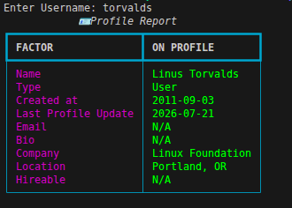
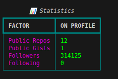
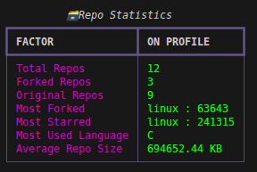
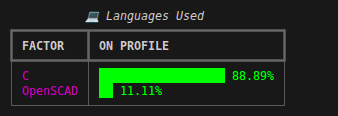
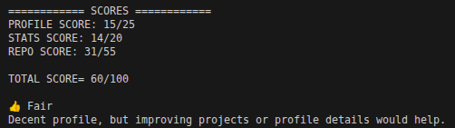

# 📊 GitHub Profile Analyzer

A terminal-based Python application that fetches and analyzes a GitHub user's public profile using the GitHub REST API. The program generates clean, colorful reports using the **Rich** library and evaluates the profile with a custom **100-point scoring system**.

> ⚠️ **Note:** The profile score is a custom heuristic designed for educational and portfolio purposes. It is **not** an official GitHub metric.

---

## ✨ Features

### 🪪 Profile Analysis

Displays important profile information, including:

- Name
- Account type
- Account creation date
- Last profile update
- Email
- Bio
- Company
- Location
- Hireable status

---

### 📊 GitHub Statistics

Shows:

- Public repositories
- Public gists
- Followers
- Following

---

### 🗃 Repository Analysis

Analyzes all public repositories and displays:

- Total repositories
- Original repositories
- Forked repositories
- Most starred repository
- Most forked repository
- Most used programming language
- Average repository size

---

### 💻 Language Usage

Displays the programming languages used across repositories along with a visual percentage bar.

Example:

```
Python      ██████████ 58.7%
C++         ██████     24.3%
JavaScript  ███        12.1%
HTML        █          4.9%
```

---

### 🏆 GitHub Profile Score

The application evaluates a GitHub profile using a custom **100-point scoring system**.

| Category | Maximum Score |
|----------|--------------:|
| Profile Completeness | 25 |
| GitHub Statistics | 20 |
| Repository Analysis | 55 |
| **Total** | **100** |

The score is calculated using factors such as:

- Profile completeness
- Account activity
- Repository creation rate
- Original vs forked repositories
- Most starred repository
- Most forked repository
- Programming language diversity
- Followers
- Public gists

Final rating:

| Score | Rating |
|------:|---------|
| 90–100 | 🏆 Outstanding |
| 80–89 | 🌟 Excellent |
| 70–79 | ⭐ Good |
| 60–69 | 👍 Fair |
| 50–59 | 🌱 Beginner |
| 40–49 | 🚀 Getting Started |
| 20–39 | 📝 Incomplete |
| 0–19 | 📦 Empty Profile |

---

## 📦 Installation

Clone the repository:

```bash
git clone https://github.com/YOUR_USERNAME/Github_Profile_Analyzer.git
```

Navigate to the project directory:

```bash
cd Github_Profile_Analyzer
```

Install the required dependencies:

```bash
pip install -r requirements.txt
```

Run the application:

```bash
python Profile_Analyzer.py
```

---

## 📸 Example Output

### Profile Report


---
### Statistics Report


---

### Repository Statistics


---

### Language Analysis


---

### Final Score


---

## 🛠 Built With

- Python 3
- Requests
- Rich
- GitHub REST API

---

## 📁 Project Structure

```
Github_Profile_Analyzer/
│
├── Profile_Analyzer.py
├── README.md
├── requirements.txt
├── LICENSE
├── .gitignore
└── screenshots/
```

---

## 🚀 Future Improvements

- Export reports as PDF
- Export reports as Markdown
- GitHub Personal Access Token support
- Repository health analysis
- Contribution activity analysis
- Commit frequency analysis
- Language charts
- Organization profile support
- Optional repository filtering

---

## 🤝 Contributing

Suggestions, improvements, and pull requests are always welcome.

If you discover a bug or have an idea for a new feature, feel free to open an issue.

---

## 📄 License

This project is licensed under the MIT License.

---

## 👨‍💻 Author

**SabaL**

GitHub: https://github.com/SabaL-art